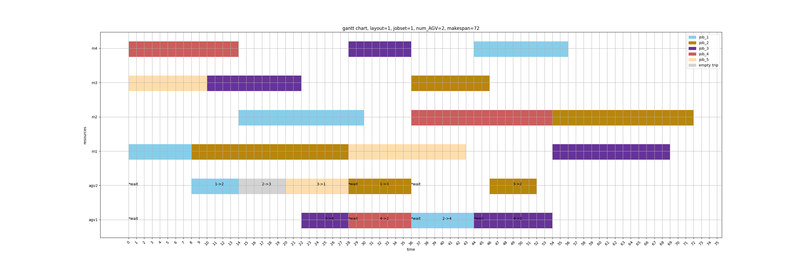

# TS_SPMA: The Tabu Search algorithm for simultaneous scheduling problem of machines and AGVs.
### Implemetation of Zheng, Y., Xiao, Y., & Seo, Y. (2014). A tabu search algorithm for simultaneous machine/AGV scheduling problem. International Journal of Production Research, 52(19), 5748-5763.
---
### requirements: 
* numpy, networkx, matplotlib
---
### Example Result 
